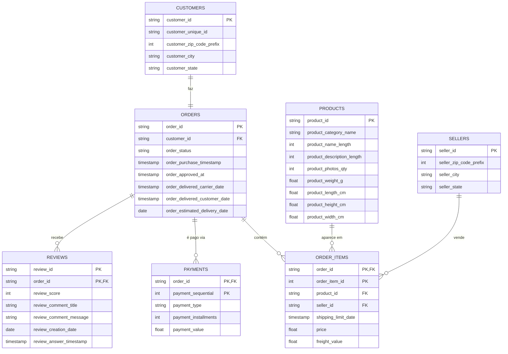

# ERD - Modelo de Dados

O modelo utiliza star schema, na variante conhecida como constelação de fatos (fact constellation ou galaxy schema): uma extensão do star schema para os casos em que existe mais de um processo de negócio mensurável.

## Notas sobre as cardinalidades

- `CUSTOMERS ||--|| ORDERS`: relação um-para-um. `customer_id` é único tanto em `customers` quanto em `orders`; todo `customer_id` de um lado tem correspondência no outro (verificado nos dois sentidos). Quem se repete entre pedidos diferentes do mesmo cliente é o `customer_unique_id`, não o `customer_id`.
- `ORDERS ||--o{ ORDER_ITEMS`: zero ou muitos. `order_items` contém apenas itens reais, na mesma granularidade da tabela de origem. Pedidos sem nenhum item (majoritariamente com status `canceled` ou `unavailable`) não têm linha correspondente em `order_items`. A tabela `orders` continua sendo a fonte completa de todos os pedidos, independentemente de terem ou não item associado. Dessa forma, qualquer análise que precise considerar todos os pedidos (incluindo cancelados) deve consultar `orders` diretamente, não inferir isso a partir de `order_items`.
- `PRODUCTS ||--o{ ORDER_ITEMS` e `SELLERS ||--o{ ORDER_ITEMS`: zero ou muitos. No recorte atual dos dados, todo `product_id` e todo `seller_id` cadastrados aparecem em pelo menos uma linha de `order_items`, mas isso é uma característica observada deste dataset específico, por isso a cardinalidade mínima documentada é zero, não um.
- `ORDERS ||--o{ PAYMENTS`: zero ou muitos. Existe ao menos um pedido com status `delivered` e itens associados que não possui nenhum registro de pagamento, uma inconsistência, mas que já demonstra por si só que a cardinalidade mínima não pode ser um.
- `ORDERS ||--o{ REVIEWS`: zero ou muitos. Parte dos pedidos não tem nenhuma review associada.

## Chaves compostas

- `ORDER_ITEMS`: a chave é a combinação de `order_id` e `order_item_id`.
- `PAYMENTS`: a chave é a combinação de `order_id` e `payment_sequential` (um pedido pode ter mais de uma linha de pagamento).
- `REVIEWS`: a chave é a combinação de `review_id` e `order_id` (um mesmo `review_id` pode estar associado a mais de um pedido, e um mesmo pedido pode ter mais de uma review em momentos diferentes).
